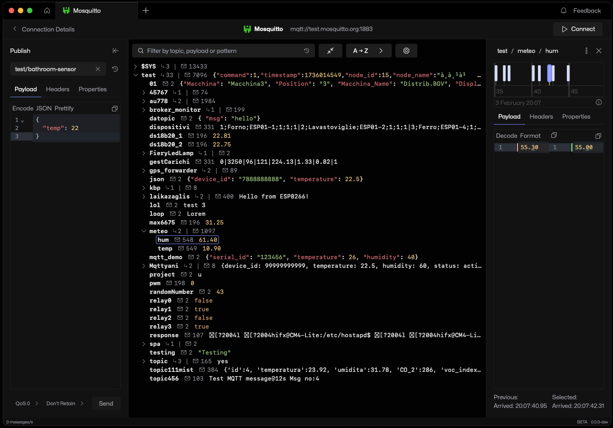

# MQTT Viewer

[MQTT Viewer](https://mqttviewer.app) is a feature-rich and performant MQTT visualisation and debugging tool for Windows, Mac and Linux.

[Download MQTT Viewer](https://github.com/mqtt-viewer/mqtt-viewer/releases)

## Features

First and foremost, MQTT Viewer is fast, responsive and easy to use.

But wait, there's more:

| Feature                                  | Status | Comments                                                                                                                                                                                                     |
| ---------------------------------------- | ------ | ------------------------------------------------------------------------------------------------------------------------------------------------------------------------------------------------------------ |
| Topic tree data visualisation            | ✅     |                                                                                                                                                                                                              |
| MQTT v3 + v5 compatibility               | ✅     |                                                                                                                                                                                                              |
| Run multiple concurrent connections      | ✅     | Up to 10 supported.                                                                                                                                                                                          |
| Message publishing (+ v5 headers)        | ✅     |                                                                                                                                                                                                              |
| Interactive message timeline             | ✅     |                                                                                                                                                                                                              |
| Message comparison                       | ✅     | Currently only compares to previous message but I'm planning on making this more flexible.                                                                                                                   |
| Sparkplug + Base64 + Hex codecs          | ✅     | ⭐ New!                                                                                                                                                                                                      |
| Free-text / pattern-based filters        | ✅     | ⭐ New!                                                                                                                                                                                                      |
| Publish history                          | ✅     | ⭐ New!                                                                                                                                                                                                      |
| Saved message collections                | 🚧     | In progress                                                                                                                                                                                                  |
| Client logs                              | 🚧     | In progress                                                                                                                                                                                                  |
| Broker status page (based on $SYS data)  | ❓     | Potential. Let me know if you might use this [here](https://github.com/mqtt-viewer/mqtt-viewer/discussions/1).                                                                                               |
| In-app local test broker                 | ❓     | Potential. This would be an alternative to running a local mosquitto instance for debugging/development. Let me know if you might use this [here](https://github.com/mqtt-viewer/mqtt-viewer/discussions/2). |
| Team workspaces + cloud collections sync | ❓     | Potential. Let me know if you might use this [here](https://github.com/mqtt-viewer/mqtt-viewer/discussions/3).                                                                                               |

Don't see a feature that would make your life easier? [I really, really want to know.](https://github.com/mqtt-viewer/mqtt-viewer/issues/new?template=feature_idea.yml)

## Contributing

If MQTT Viewer has been helpful, right now the best ways to contribute are:

- Reporting bugs and making feature requests via [GitHub issues](https://github.com/mqtt-viewer/mqtt-viewer/issues)
- Contributing to the codebase by solving bugs or implementing new features. If you're interested in contributing in this way, please [read the contributing guide](CONTRIBUTING.md) first and then choose an issue to work on!
- Giving me honest, constructive feedback about what you like and don't like about MQTT Viewer via [GitHub discussions](https://github.com/mqtt-viewer/mqtt-viewer/discussions).
- Seriously, nothing is too big or too small. [Let me know](https://github.com/mqtt-viewer/mqtt-viewer/issues) how to make MQTT Viewer better for you.
- Letting others know about MQTT Viewer on your favourite social media or blogs.
- Leaving MQTT Viewer [a testimonal!](https://testimonial.to/mqtt-viewer/)

## Development

MQTT Viewer is built using [Wails](https://wails.io/), a Go-based application framework, and [Svelte](https://svelte.dev/).

### Prerequisites

- [Go](https://golang.org/doc/install)
- [Node.js](https://nodejs.org/en/download/)
- [Wails](https://wails.io/docs/gettingstarted/installation) (install via `go get github.com/wailsapp/wails/v2/cmd/wails@2.9.1`)
- [pnpm](https://pnpm.io/installation) (install via `npm install -g pnpm`)
- [Just](https://github.com/casey/just?tab=readme-ov-file#cross-platform) - optional, but recommended for running commands in the project
- [Atlas](https://github.com/ariga/atlas) - optional, only necessary if you need to create database migrations

### Setup

1. Clone the repository with `git clone https://github.com/mqtt-viewer/mqtt-viewer`
2. Navigate to the project directory with `cd mqtt-viewer`
3. Install the Go dependencies with `go mod tidy`
4. Navigate to the frontend directory with `cd frontend`
5. Install the Node.js dependencies with `pnpm install`
6. Navigate back to the root directory with `cd ..`
7. Run the application with `just dev` (or `wails dev` if you don't have Just installed)

If there are problems with Wails, try running `wails doctor` to check your installation.

Please open an issue if you have any problems.

### Hot Reloading

Changes to the frontend code will automatically trigger a rebuild and reload the application quickly.

This may cause some issues if the frontend and backend are now out of sync. If so, just restart the application.

Changes to the Go code will trigger a full rebuild which may take anywhere from a few seconds to a minute depending on your hardware specs.

## License

MQTT Viewer is open-source under [GPLv3](https://www.gnu.org/licenses/gpl-3.0.html).

All features are currently available to use freely.
