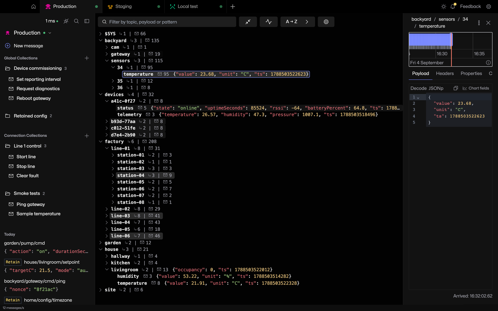

# MQTT Viewer

[MQTT Viewer](https://mqttviewer.app) is a feature-rich and performant MQTT visualisation and debugging tool for Windows, Mac and Linux.

[Download MQTT Viewer](https://github.com/mqtt-viewer/mqtt-viewer/releases)



## Features

First and foremost, MQTT Viewer is fast, responsive and easy to use.

But wait, there's more:

| Feature                                  | Status | Comments                                                                                                                                                                                                     |
| ---------------------------------------- | ------ | ------------------------------------------------------------------------------------------------------------------------------------------------------------------------------------------------------------ |
| Topic tree data visualisation            | ✅     |                                                                                                                                                                                                              |
| MQTT v3 + v5 compatibility               | ✅     |                                                                                                                                                                                                              |
| Run multiple concurrent connections      | ✅     |                                                                                                                                                                                                              |
| Message publishing (+ v5 headers)        | ✅     |                                                                                                                                                                                                              |
| Interactive message timeline             | ✅     |                                                                                                                                                                                                              |
| Message comparison                       | ✅     | Currently only compares to previous message but I'm planning on making this more flexible.                                                                                                                   |
| Live topic charting                      | ✅     | ⭐ New! Chart numeric payload fields over time, with a pop-out chart window.                                                                                                                                 |
| Saved message collections                | ✅     | ⭐ New! Save messages per connection or globally and republish them with a click.                                                                                                                            |
| Bounded memory usage                     | ✅     | ⭐ New! Message history stays within a configurable memory budget, with opt-in recording to disk.                                                                                                            |
| Image payload previews                   | ✅     | ⭐ New! PNG, JPEG, GIF, WebP and BMP payloads render as images.                                                                                                                                              |
| Web UI via Docker                        | ✅     | ⭐ New! Run the full app headless and use it from a browser. See [docs/DOCKER.md](docs/DOCKER.md).                                                                                                           |
| Sparkplug + Base64 + Hex codecs          | ✅     |                                                                                                                                                                                                              |
| Free-text / pattern-based filters        | ✅     |                                                                                                                                                                                                              |
| Publish history                          | ✅     |                                                                                                                                                                                                              |
| Client logs                              | 🚧     | In progress                                                                                                                                                                                                  |
| Broker status page (based on $SYS data)  | ❓     | Potential. Let me know if you might use this [here](https://github.com/mqtt-viewer/mqtt-viewer/discussions/1).                                                                                               |
| In-app local test broker                 | ❓     | Potential. This would be an alternative to running a local mosquitto instance for debugging/development. Let me know if you might use this [here](https://github.com/mqtt-viewer/mqtt-viewer/discussions/2). |
| Team workspaces + cloud collections sync | ❓     | Potential. Let me know if you might use this [here](https://github.com/mqtt-viewer/mqtt-viewer/discussions/3).                                                                                               |

Don't see a feature that would make your life easier? [I really, really want to know.](https://github.com/mqtt-viewer/mqtt-viewer/issues/new?template=feature_idea.yml)

## Run it in your browser (Docker)

Prefer a web UI, or want MQTT Viewer running on a server or NAS? The same app
ships as a Docker image:

```sh
docker run -d --name mqtt-viewer \
  -p 127.0.0.1:8080:8080 \
  -v mqtt-viewer-data:/data \
  ghcr.io/mqtt-viewer/mqtt-viewer:latest
```

Open http://localhost:8080. It is the full app served over HTTP: same backend,
same features, live updates included.

That command publishes the port to this machine only. There is no built-in
login, and anyone who can load the page can read your saved broker passwords,
so to reach it from other devices drop the `127.0.0.1:` and only do it on a
network you trust, or put an authenticating reverse proxy in front. Setup,
configuration and the few differences from the desktop app are covered in
[docs/DOCKER.md](docs/DOCKER.md).

## Installing with Nix

This repository is a flake, so on Linux you can build and run MQTT Viewer straight from source. It covers `x86_64-linux` and `aarch64-linux`.

Run it without adding it to your profile:

```sh
nix run github:mqtt-viewer/mqtt-viewer
```

Install it properly, with the desktop entry and icon:

```sh
nix profile add github:mqtt-viewer/mqtt-viewer
```

Or pin it in a NixOS or home-manager configuration:

```nix
{
  inputs.mqtt-viewer.url = "github:mqtt-viewer/mqtt-viewer";

  # then, in your package list
  environment.systemPackages = [ inputs.mqtt-viewer.packages.${pkgs.system}.default ];
}
```

### Installation size

MQTT Viewer is not in nixpkgs yet, so nothing is prebuilt. The first build compiles the Go binary and the frontend on your machine.

The package itself is 23 MiB. The catch is everything under it: the app needs GTK 3 and WebKit2GTK, and Nix uses its own copies rather than the ones your distribution already ships. The full closure is about 920 MiB across 186 store paths, and WebKitGTK with its GStreamer stack is nearly all of that. Check for yourself before committing to it:

```sh
nix path-info -Sh github:mqtt-viewer/mqtt-viewer#default
```

Most of it comes prebuilt from cache.nixos.org instead of being compiled locally, and it is shared with every other GTK app in your store, so the marginal cost is smaller if you already run one.

### Updating

Update through Nix, not through the app:

```sh
nix profile upgrade --all
```

The app recognises a Nix install and points you at Nix. Store paths are immutable, so it will not try to replace its own binary. The in-app text assumes a profile install; if you pinned MQTT Viewer in a NixOS or home-manager configuration, update the flake input and rebuild instead.

## Contributing

If MQTT Viewer has been helpful, right now the best ways to contribute are:

- Reporting bugs and making feature requests via [GitHub issues](https://github.com/mqtt-viewer/mqtt-viewer/issues)
- Contributing to the codebase by solving bugs or implementing new features. If you're interested in contributing in this way, please [read the contributing guide](CONTRIBUTING.md) first and then choose an issue to work on!
- Giving me honest, constructive feedback about what you like and don't like about MQTT Viewer via [GitHub discussions](https://github.com/mqtt-viewer/mqtt-viewer/discussions).
- Seriously, nothing is too big or too small. [Let me know](https://github.com/mqtt-viewer/mqtt-viewer/issues) how to make MQTT Viewer better for you.
- Letting others know about MQTT Viewer on your favourite social media or blogs.
- Leaving MQTT Viewer [a testimonal!](https://testimonial.to/mqtt-viewer/)

## Development

MQTT Viewer is built using [Wails](https://wails.io/), a Go-based application framework, and [Svelte](https://svelte.dev/).

### Prerequisites

- [Go](https://golang.org/doc/install)
- [Node.js](https://nodejs.org/en/download/)
- [Wails v3](https://v3.wails.io/quick-start/installation/) (install via `go install github.com/wailsapp/wails/v3/cmd/wails3@v3.0.0-alpha.98-tui`, matching the version pinned in go.mod)
- [pnpm](https://pnpm.io/installation) (install via `npm install -g pnpm`)
- [Just](https://github.com/casey/just?tab=readme-ov-file#cross-platform) - optional, but recommended for running commands in the project
- [Atlas](https://github.com/ariga/atlas) - optional, only necessary if you need to create database migrations

If you use Nix, `nix develop` gives you all of the above, including the pinned `wails3` CLI and the GTK/WebKit libraries the Linux build needs.

### Setup

1. Clone the repository with `git clone https://github.com/mqtt-viewer/mqtt-viewer`
2. Navigate to the project directory with `cd mqtt-viewer`
3. Install the Go dependencies with `go mod tidy`
4. Navigate to the frontend directory with `cd frontend`
5. Install the Node.js dependencies with `pnpm install`
6. Navigate back to the root directory with `cd ..`
7. Run the application with `just dev` (or `wails3 dev` if you don't use Just)

If there are problems with Wails, try running `wails3 doctor` to check your installation.

Please open an issue if you have any problems.

### Common commands

From the repository root:

```sh
just dev                 # run the app with hot reload
just test                # run the Go tests
just build               # package the app for your platform
just new-migration NAME  # create a database migration (requires Atlas)
```

From the `frontend/` directory:

```sh
pnpm check          # svelte-check, keep at 0 errors
pnpm test:run       # vitest unit tests
pnpm storybook      # component library on port 6006
pnpm ds:validate    # design-system validation (run by CI)
pnpm test-storybook # Storybook interaction tests
```

`just dev` derives its dev-server port from the checkout path so parallel
checkouts don't collide. See `docs/MULTI_AGENT_DEV.md` if you need to
override it.

### Hot Reloading

Changes to the frontend code will automatically trigger a rebuild and reload the application quickly.

This may cause some issues if the frontend and backend are now out of sync. If so, just restart the application.

Changes to the Go code will trigger a full rebuild which may take anywhere from a few seconds to a minute depending on your hardware specs.

## License

MQTT Viewer is open-source under [GPL-3.0-or-later](https://www.gnu.org/licenses/gpl-3.0.html).

All features are free to use.
