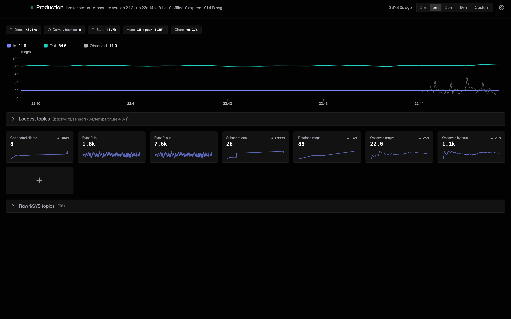
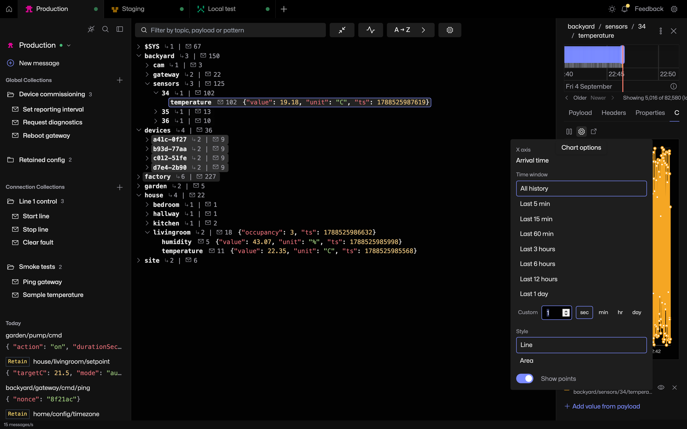
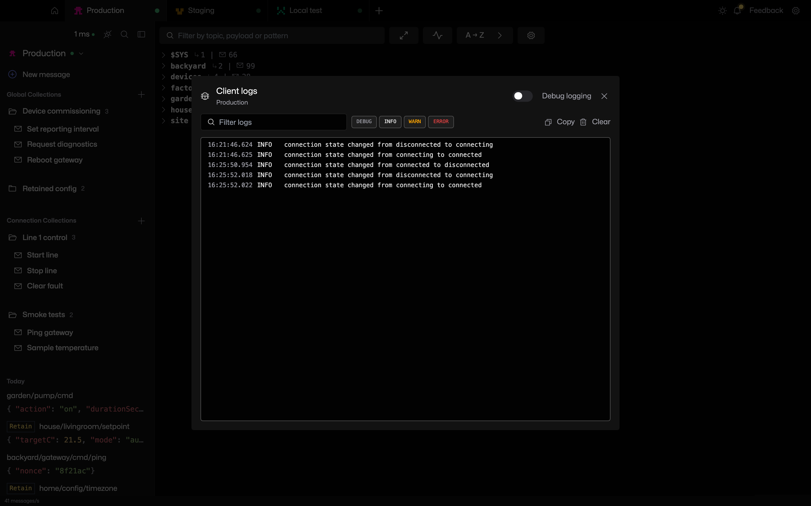
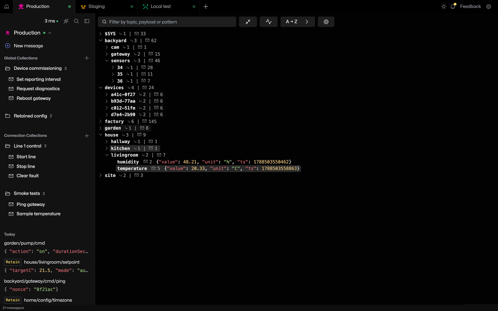

# MQTT Viewer

[MQTT Viewer](https://mqttviewer.app) is a fast desktop MQTT client for Windows, Mac and Linux. Connect to several brokers at once, watch every topic update in a live tree, scrub back through history on a timeline, chart values, decode payloads and republish messages, all from one window.

[Download MQTT Viewer](https://mqttviewer.app/download) or grab a build from the [releases page](https://github.com/mqtt-viewer/mqtt-viewer/releases). Free and open source under GPL-3.0.


## Features

First and foremost, MQTT Viewer is fast, responsive and easy to use. It stays smooth with two brokers each pushing a couple of thousand messages a second, because that is how I test it.

But wait, there's more:

| Feature | Notes |
| --- | --- |
| Live topic tree | Every topic on the broker, with counts, last values and a text filter. |
| Topic Graph | The namespace drawn as a tree where node size is message rate and colour is recency. Collapse branches, follow the hottest, pause, go fullscreen. |
| Topic actions | Right-click any topic to copy its path or payload, export its history, or clear retained messages below it. Retained topics are marked. |
| Up to 10 connections at once | Each in its own tab. MQTT v3.1.1 and v5, TCP, TLS, mutual TLS and WebSocket. |
| Interactive message timeline | Scrub through a topic's history. Hover a marker to preview the payload. |
| Message comparison | Diff a message against the previous one on the same topic. |
| Live charting | Tick numeric fields in a JSON payload and plot them. Time windows from seconds to days, pop-out chart windows. |
| Broker status page | Clients, rates, subscriptions, retained count, uptime and health signals from `$SYS`, plus client-side rates and loudest topics for brokers that publish nothing. |
| Client logs | A terminal-style view of what the MQTT library is doing on each connection, with a debug level and a rotating log file. |
| Message collections | Save messages into folders, global or per connection, drag them between folders and republish with a click. |
| Publish history | Everything you have sent, searchable, ready to send again. |
| Payload decoding | Sparkplug B, Base64 and Hex codecs. PNG, JPEG, GIF, WebP and BMP payloads render as images. |
| Dockable topic panel | Dock the selected-topic panel right, bottom, or pop it out into its own window. |
| Bounded memory | History stays inside a memory budget you set, with optional recording to disk. |
| Web UI | The full app served over HTTP from a Docker image, and a Home Assistant add-on. |
| Light and dark themes | |

Every one of these has its own page, with screenshots, at [mqttviewer.app/features](https://mqttviewer.app/features). A few of them:









Still thinking about, and would love to hear whether you'd use them:

- An in-app local test broker, as an alternative to running mosquitto for development. [Discussion](https://github.com/mqtt-viewer/mqtt-viewer/discussions/2)
- Team workspaces and cloud sync for collections. [Discussion](https://github.com/mqtt-viewer/mqtt-viewer/discussions/3)

Don't see a feature that would make your life easier? [I really, really want to know.](https://github.com/mqtt-viewer/mqtt-viewer/issues/new?template=feature_idea.yml)

## Installing

Every release ships builds for all three platforms. The app checks for updates itself and, where the install type allows it, updates in place.

### Docker and Home Assistant

The same app runs headless and serves itself to a browser:

```sh
docker run -d --name mqtt-viewer \
  -p 127.0.0.1:8080:8080 \
  -v mqtt-viewer-data:/data \
  ghcr.io/mqtt-viewer/mqtt-viewer:latest
```

Open http://localhost:8080. There is no login screen, so keep it on localhost or a trusted network, or put an authenticating proxy in front. [docs/DOCKER.md](docs/DOCKER.md) has the details, a Caddy example and the security caveats.

For Home Assistant, add [github.com/mqtt-viewer/home-assistant-addon](https://github.com/mqtt-viewer/home-assistant-addon) as an add-on repository and install MQTT Viewer from the store.

### macOS

Download the zip for Apple Silicon or Intel from [mqttviewer.app/download/mac](https://mqttviewer.app/download/mac), unzip, and drag MQTT Viewer to Applications. The app is signed and notarised.

### Windows

Download the installer from [mqttviewer.app/download/windows](https://mqttviewer.app/download/windows). There are separate installers for x64 and ARM64, so Snapdragon laptops get a native build rather than emulation. A portable zip is on the releases page too.

### Linux

Builds cover x86_64 and ARM64. Pick whichever fits your distribution:

| Format | Install | Updates |
| --- | --- | --- |
| AppImage | `chmod +x MQTT_Viewer-*.AppImage && ./MQTT_Viewer-*.AppImage` | In-app |
| deb | `sudo apt install ./MQTT_Viewer_*.deb` | Download the next deb |
| rpm | `sudo dnf install ./MQTT_Viewer_*.rpm` | Download the next rpm |
| Flatpak | See below | `flatpak update` |
| Nix | See below | `nix profile upgrade --all` |

#### Flatpak

There is a signed Flatpak repository, so installs update through Flatpak like any other app:

```sh
flatpak remote-add --if-not-exists mqtt-viewer https://dl.mqttviewer.app/mqtt-viewer.flatpakrepo
flatpak install mqtt-viewer app.mqttviewer.MQTTViewer
```

Each release also attaches a single-file `.flatpak` bundle per architecture if you would rather not add a remote. Bundles do not auto-update.

#### Nix

This repository is a flake covering `x86_64-linux` and `aarch64-linux`.

Run it without adding it to your profile:

```sh
nix run github:mqtt-viewer/mqtt-viewer
```

Install it properly, with the desktop entry and icon:

```sh
nix profile add github:mqtt-viewer/mqtt-viewer
```

Or pin it in a NixOS or home-manager configuration:

```nix
{
  inputs.mqtt-viewer.url = "github:mqtt-viewer/mqtt-viewer";

  # then, in your package list
  environment.systemPackages = [ inputs.mqtt-viewer.packages.${pkgs.system}.default ];
}
```

MQTT Viewer is not in nixpkgs yet, so nothing is prebuilt. The first build compiles the Go binary and the frontend on your machine.

The package itself is 23 MiB. The catch is everything under it: the app needs GTK 3 and WebKit2GTK, and Nix uses its own copies rather than the ones your distribution already ships. The full closure is about 920 MiB across 186 store paths, and WebKitGTK with its GStreamer stack is nearly all of that. Check for yourself before committing to it:

```sh
nix path-info -Sh github:mqtt-viewer/mqtt-viewer#default
```

Most of it comes prebuilt from cache.nixos.org instead of being compiled locally, and it is shared with every other GTK app in your store, so the marginal cost is smaller if you already run one.

Update through Nix, not through the app:

```sh
nix profile upgrade --all
```

The app recognises a Nix install and points you at Nix. Store paths are immutable, so it will not try to replace its own binary. The in-app text assumes a profile install; if you pinned MQTT Viewer in a NixOS or home-manager configuration, update the flake input and rebuild instead.

## Contributing

If MQTT Viewer has been helpful, right now the best ways to contribute are:

- Reporting bugs and making feature requests via [GitHub issues](https://github.com/mqtt-viewer/mqtt-viewer/issues)
- Contributing to the codebase by solving bugs or implementing new features. If you're interested in contributing in this way, please [read the contributing guide](CONTRIBUTING.md) first and then choose an issue to work on!
- Giving me honest, constructive feedback about what you like and don't like about MQTT Viewer via [GitHub discussions](https://github.com/mqtt-viewer/mqtt-viewer/discussions).
- Seriously, nothing is too big or too small. [Let me know](https://github.com/mqtt-viewer/mqtt-viewer/issues) how to make MQTT Viewer better for you.
- Letting others know about MQTT Viewer on your favourite social media or blogs.
- Leaving MQTT Viewer [a testimonial.](https://testimonial.to/mqtt-viewer/)

## Development

MQTT Viewer is built using [Wails](https://wails.io/), a Go-based application framework, and [Svelte](https://svelte.dev/).

### Prerequisites

- [Go](https://golang.org/doc/install)
- [Node.js](https://nodejs.org/en/download/)
- [Wails v3](https://v3.wails.io/quick-start/installation/) (install via `go install github.com/wailsapp/wails/v3/cmd/wails3@v3.0.0-alpha.98-tui`, matching the version pinned in go.mod)
- [pnpm](https://pnpm.io/installation) (install via `npm install -g pnpm`)
- [Just](https://github.com/casey/just?tab=readme-ov-file#cross-platform) - optional, but recommended for running commands in the project
- [Atlas](https://github.com/ariga/atlas) - optional, only necessary if you need to create database migrations

If you use Nix, `nix develop` gives you all of the above, including the pinned `wails3` CLI and the GTK/WebKit libraries the Linux build needs.

### Setup

1. Clone the repository with `git clone https://github.com/mqtt-viewer/mqtt-viewer`
2. Navigate to the project directory with `cd mqtt-viewer`
3. Install the Go dependencies with `go mod tidy`
4. Navigate to the frontend directory with `cd frontend`
5. Install the Node.js dependencies with `pnpm install`
6. Navigate back to the root directory with `cd ..`
7. Run the application with `just dev` (or `wails3 dev` if you don't use Just)

If there are problems with Wails, try running `wails3 doctor` to check your installation.

Please open an issue if you have any problems.

### Common commands

From the repository root:

```sh
just dev                 # run the app with hot reload
just test                # run the Go tests
just build               # package the app for your platform
just new-migration NAME  # create a database migration (requires Atlas)
```

From the `frontend/` directory:

```sh
pnpm check          # svelte-check, keep at 0 errors
pnpm test:run       # vitest unit tests
pnpm storybook      # component library on port 6006
pnpm ds:validate    # design-system validation (run by CI)
pnpm test-storybook # Storybook interaction tests
```

`just dev` derives its dev-server port from the checkout path so parallel
checkouts don't collide. See `docs/MULTI_AGENT_DEV.md` if you need to
override it.

### Hot Reloading

Changes to the frontend code will automatically trigger a rebuild and reload the application quickly.

This may cause some issues if the frontend and backend are now out of sync. If so, just restart the application.

Changes to the Go code will trigger a full rebuild which may take anywhere from a few seconds to a minute depending on your hardware specs.

## License

MQTT Viewer is open-source under [GPL-3.0-or-later](https://www.gnu.org/licenses/gpl-3.0.html).

All features are free to use.
